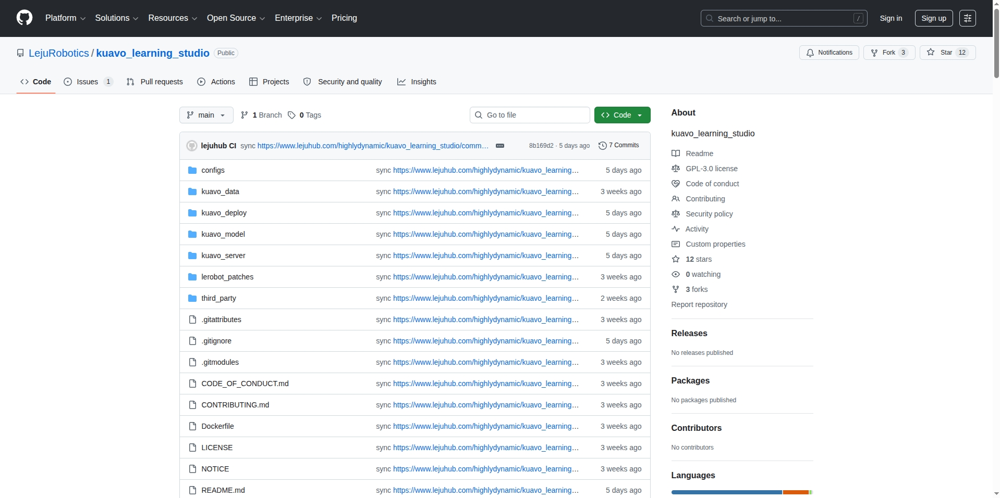
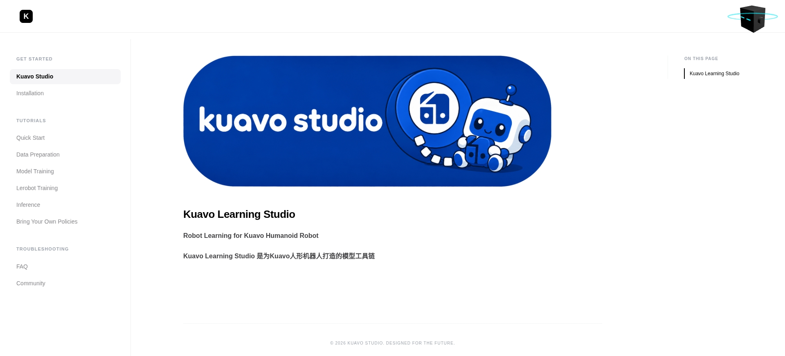
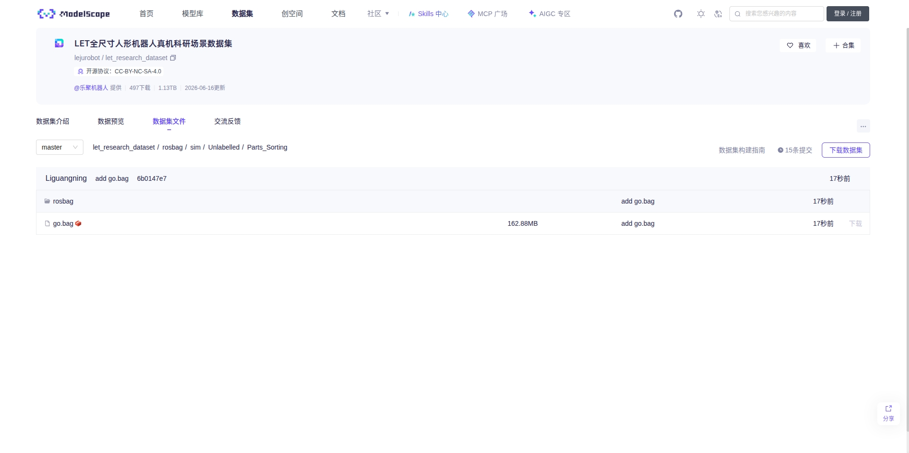
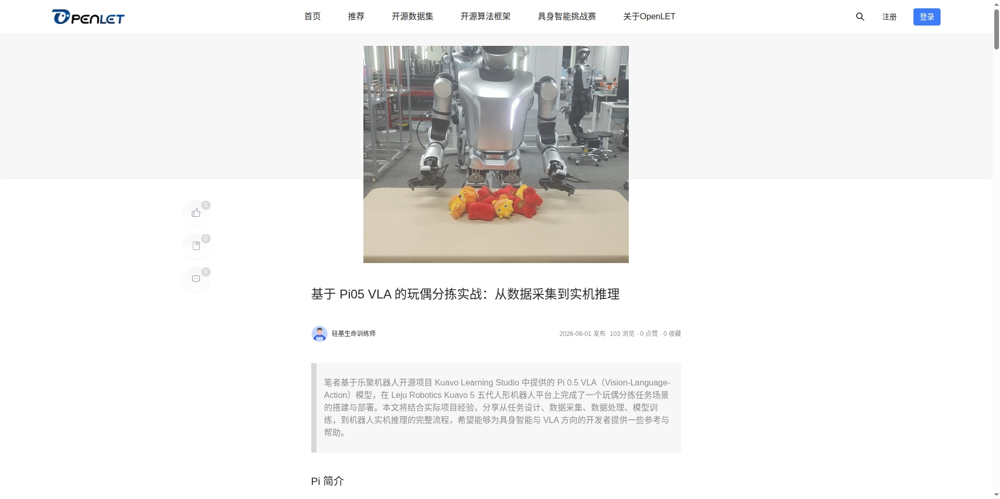

# kuavo_learning_studio 使用说明

`collect_scene1_dataset` 包含比赛任务一（快递分拣交接）的数据采集脚本，详细使用说明看路径内 README。
`collect_scene2_dataset` 包含比赛任务二的数据采集脚本，详细使用说明看路径内 README。

kuavo_learning_studio具体使用说明请进入kuavo_learning_studio 文档网站查看。

## 相关链接

- kuavo_learning_studio 仓库：[https://github.com/LejuRobotics/kuavo_learning_studio](https://github.com/LejuRobotics/kuavo_learning_studio)



- kuavo_learning_studio 文档网站：[https://huangrc1110.github.io/kuavo_docs/docs.html#get_started/intro.md](https://huangrc1110.github.io/kuavo_docs/docs.html#get_started/intro.md)



- 任务二仿真数据集：[https://www.modelscope.cn/datasets/lejurobot/let_research_dataset/tree/master/rosbag/sim/Unlabelled](https://www.modelscope.cn/datasets/lejurobot/let_research_dataset/tree/master/rosbag/sim/Unlabelled)  
数据集机器人初始姿态：  
手臂角度：`JOINT_ANGLE = [30, 10, 10, -120, -60, 0, 0, 30, -10, -10, -120, 60, 0, 0]`  
头部角度：`HEAD_ANGLE = [0.0, 20.0]`  



- （openlet社区真机参考案例）基于 Pi05 VLA 的玩偶分拣实战：从数据采集到实机推理：[https://openlet.openatom.tech/explore/journalism/detail/584219818870312960](https://openlet.openatom.tech/explore/journalism/detail/584219818870312960)



## 注意事项

### 数据转换

使用提供的仿真数据集或者自己采集的数据集进行数据转换时，会需要编辑配置文件 `configs/data/KuavoRosbag2Lerobot.yaml`
```bash
# =======================这一项不用修改=======================
hydra:  # Hydra 配置文件保存目录，仅供参数检查使用
  run:
    dir: ./outputs/data_cvt_hydra_save/singlerun/${now:%Y%m%d_%H%M%S}  # 单次运行目录
  sweep:
    dir: ./outputs/data_cvt_hydra_save/multirun/${now:%Y%m%d_%H%M%S}  # sweep 时的根目录
    subdir: ${hydra:job.override_dirname}

# =======================根据实际情况修改以下参数========================
rosbag:
  mode: normal  # 可选: normal, resume, merge，一般正常数转用normal即可，关于三种模式的详细说明见后文
  rosbag_dir: /path/to/rosbags # rosbag文件存放的目录。normal / resume 模式需要
  target_dir: /path/to/target_dir  # 输出父目录；最终数据集会生成在 target_dir/lerobot
  lerobot_dir_resume: /path/to/lerobot_resume  # resume 模式下才需要修改，已有 lerobot 数据集的目录
  lerobot_dir_merge: 
    ["/path/to/lerobot1",
    "/path/to/lerobot2"]  # merge 模式下才需要修改，要合并的多个 lerobot 数据集目录列表

dataset:
  platform_type: "5"  # 硬件平台类型，可选: "4pro", "5w" 或 "5"
  eef_type: rq2f85 # 末端执行器类型，仿真选择：rq2f85, 真机可选：leju_claw,（夹爪） qiangnao，（灵巧手）
  which_arm: both  # 需要哪一只手臂的关节 + 图像数据，可选: left, right, both，注意图像数据会同时包含头部相机图像
 
  task_description: "Pick and Place" # 任务描述，自定义

# =======================以下参数一般不需要修改，除非对数据转换有特殊需求========================
  train_hz: 10  # 训练数据的采样频率
  main_timeline: head_cam_h # 将哪个相机设为主相机，默认主相机来自：head_cam_h, 可选：wrist_cam_l, wrist_cam_r
  main_timeline_fps: 30 # 主相机的帧率，必须稳定，默认30帧
  sample_drop: 10 # 丢弃episode前后的10帧

  resize:
    width: 848  # 图像缩放宽度，真机一般是848，仿真一般是640，建议根据rosbag中图像的原始尺寸进行设置，避免放大或缩小带来模糊或拉伸变形等问题
    height: 480  # 图像缩放高度，真机和仿真一般都是480，建议根据rosbag中图像的原始尺寸进行设置，避免放大或缩小带来模糊或拉伸变形等问题
```
重要参数：

|参数|描述|参考值|
| :-: | :-: | :-: |
|`platform_type`|选择Kuavo 5 人形机器人平台|"5"|
|`eef_type`|选择仿真使用的rq2f85|rq2f85|
|`rosbag_dir`|输入rosbag路径|/path/to/rosbags|
|`target_dir`|输出lerobot路径|/path/to/target_dir|
|`task_description`|任务描述(prompt)，使用VLA进行训练的时候会用上|"Pick and Place"|
|`width height`|图像缩放宽度与高度，此次挑战杯仿真环境相机原始图像为1280*720，建议resize为848*480，避免训练时缓存占用过大，也可自行选择|848 480|

### 仿真推理
需要先修改推理配置文件 `configs/deploy/deploy.yaml`

重要参数：

|参数|描述|参考值|
| :-: | :-: | :-: |
|`inference_env`|推理环境选择仿真|sim|
|`platform_type`|选择Kuavo 5 人形机器人平台|"5"|
|`eef_type`|选择仿真使用的rq2f85|rq2f85|
|`go_bag_path`|播放达到工作位置的rosbag路径，可使用数据集里的go.bag|null|
|`policy_type`|模型类型或client模式|diffusion|
|`width height`|图像缩放宽度与高度，与数据转换对齐|848 480|

先按仓库主页readme说明启动仿真环境，比如：
```
rosrun challenge_cup_task_template challenge_task.py --scene scene2 --seed 0
```
然后可以使用手臂控制接口和头部控制接口到达初始工作位置（即数采时的初始位置），或是通过播放rosbag的方式到达初始工作位置。

例如运行推理脚本：
```bash
python kuavo_deploy/eval.py
```

运行后会出现4个选项
```bash
1. go              : 普通任务: 先插值到bag第一帧的位置, 再回放bag包前往工作位置
2. run             : 普通任务: 从当前位置直接运行模型
3. auto_test       : 仿真测试任务：仿真中自动测试模型，执行 eval_episodes 次
4. 退出
```
- 选项1是将机器人双臂移动到config中设置的bag的第一帧位置，方便开始任务
- 选项2是直接开始推理，机器人会从当前位置开始执行模型的输出
- 选项3会在仿真环境中自动运行评测，只有在仿真中需要使用
- 选项4是退出程序  

先选1播放bag移动到初始位置，然后选2开始推理，选项3不用选。 

若使用kuavo_model中的外置模型进行推理，则需要先启动对应的环境和server：
```bash
python kuavo_server/launch.py openpi/groot/lingbotvla # 选择你要启动的模型
```

之后将`inference.policy_type`设置为client，再运行`python kuavo_deploy/eval.py`

此处仅做简单说明，详情请进入kuavo_learning_studio文档网站进行查看。